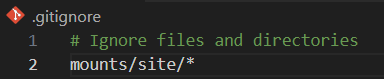
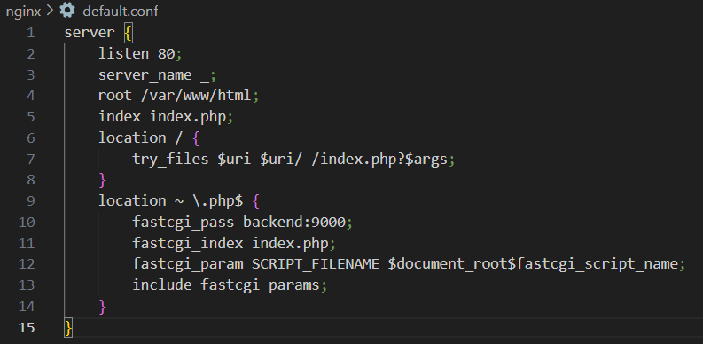
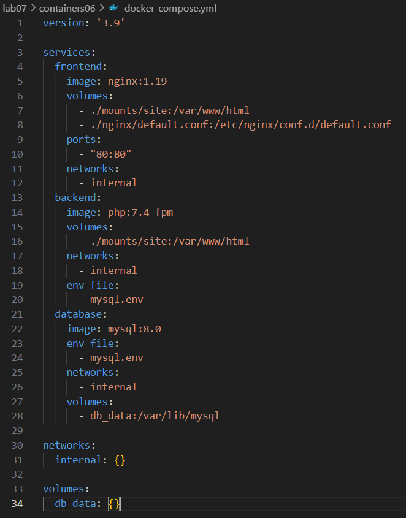
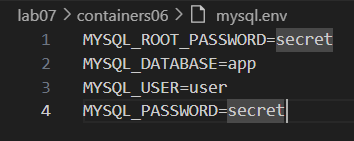
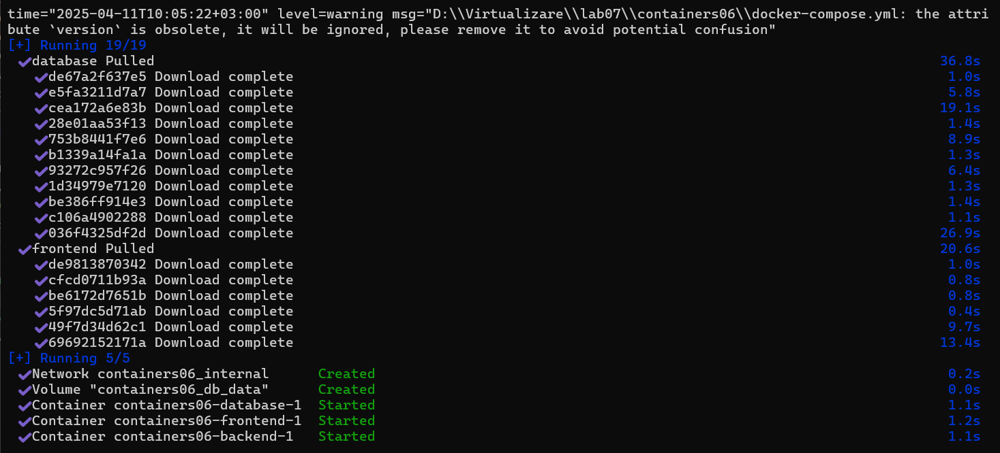
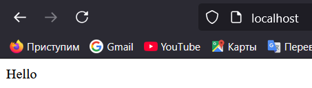

# Lucrarea de laborator Nr7

## Scopul lucrării

Famialiarizarea cu gestiunea aplicației multi-container creat cu docker-compose.

## Sarcina

Crearea unei aplicație PHP pe baza a trei containere: nginx, php-fpm, mariadb, folosind docker-compose.

## Descrierea efectuării lucrării

1. Am creat un nou folder numit `containers06` și l-am clonat sau copiat local.

2. Am creat în directorul containers06 un directorul numit mounts/site, unde am copiat fișierul PHP

3. Am creat fișierul `.gitignore` în rădăcina proiectului și am adăugat:



4. Am creat fișierul `nginx/default.conf` cu următorul conținut:



5. Am creat în directorul containers06 fișierul `docker-compose.yml` cu următorul conținut:



6. Am creat fișierul `mysql.env` în rădăcina proiectului cu următorul conținut:



## Pornirea și Testarea

1. Am pornit containerele cu comanda:



2. Am deschis http://localhost pentru a verifica funcționalitatea fișierului php:



## Răspunsuri la întrebări

### În ce ordine sunt pornite containerele?
În mod implicit, docker-compose nu garantează o ordine strictă de pornire a serviciilor decât dacă se folosesc directivele depends_on.

### Unde sunt stocate datele bazei de date?
Datele bazei de date sunt stocate într-un volum numit db_data, specificat în fișierul docker-compose.yml.

### Cum se numesc containerele proiectului?
Dacă nu este specificat un container_name explicit în docker-compose.yml, containerele sunt denumite automat de docker-compose.

### Trebuie să adăugați încă un fișier app.env cu variabila de mediu APP_VERSION pentru serviciile backend și frontend. Cum se face acest lucru?
Trebuie să adăugăm fișierul app.env cu variabila de mediu APP_VERSION pentru serviciile backend și frontend, motivul principal este pentru a gestiona mai eficient configurațiile aplicației într-un mod flexibil și centralizat. Pașii:

1. Crearea fișierului `app.env` în rădăcina proiectului.

2. Adaugarea APP_VERSION=VERSIUNEA_DORITA în `app.env`.

3. Modificarea docker-compose.yml pentru a include acest fișier în serviciile frontend și backend:
```yaml
frontend:
    ...
    env_file:
      - app.env

  backend:
    ...
    env_file:
      - mysql.env
      - app.env
```
## Concluzie

Prin această lucrare de laborator, am învățat cum să creez o aplicație PHP folosind o arhitectură multi-container cu ajutorul docker-compose. Am configurat separat serviciile nginx, php-fpm și mariadb, am gestionat fișierele de configurare și variabilele de mediu, și am testat funcționarea corectă a aplicației.